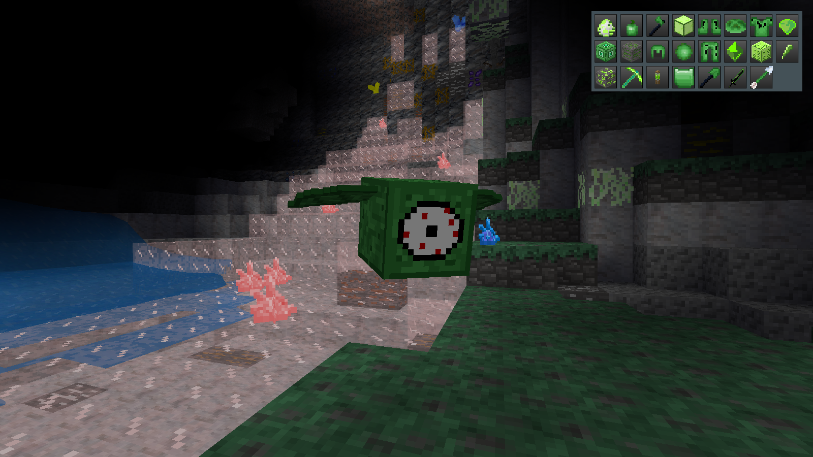

# Alien Material [`alien_material`]

This is a fork of [this mod](https://gitlab.com/debiankaios/alien_material) for the minetest game

## Description

* Removed: biome, multitool, other non-functional items
* Tools and armor are balanced
* Arrow added for x_bows
* Support for toolranks and tt_base
* Items can sometimes be found in chests or bought from mobs_npc traders
* The alien gives more generous gifts
